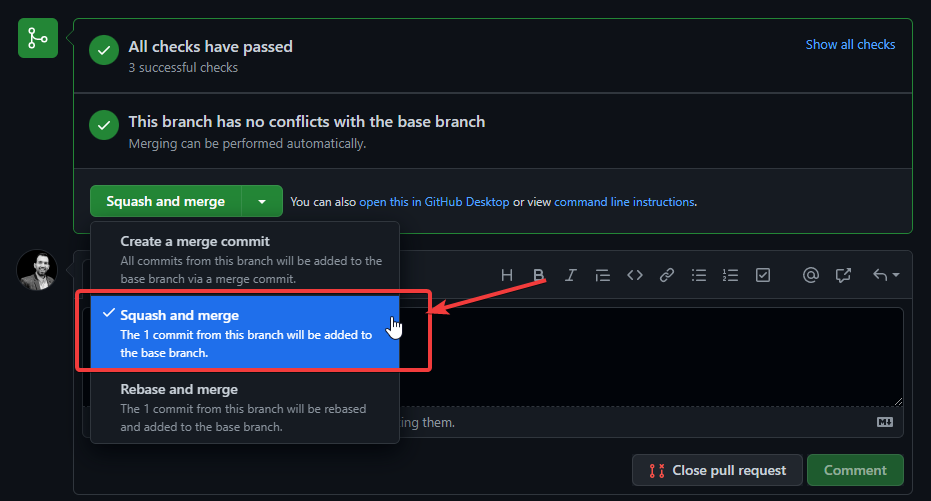
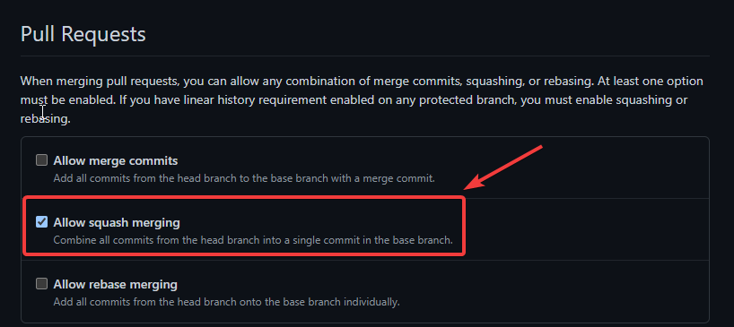

# generate-version-and-release-notes-gh-action

- [Features](#features)
- [Requirements](#requirements)
- [How to use](#how-to-use)
- [License Summary](#license-summary)

## Features

- 23-05-2022: CHANGELOG file now are rendered with markdown links for JIRA tickets.
- 10-06-2022: Added custom changelog update through scopes.

## Requirements

:warning: Attention! You need to merge your pull requests using the "squash" option.



You have to update your repo to only allow that `squash and merge`:



:warning: Your commits must follow conventional commits. To ensure that you can use our GH action to validate your PRs: [ensure-conventional-commits-gh-action](https://github.com/ohpensource/ensure-conventional-commits-gh-action/).

## How to use

This repository includes an action to semantically version your repository once a merge happens to the main branch. This is an example on how to use the action in your own repository:

```yaml
name: CD
on:
  push:
    branches: [main]
jobs:
  semver-changelog:
    runs-on: ubuntu-latest
    steps:
      - uses: actions/checkout@v2
        with:
          fetch-depth: 0
          token: ${{ secrets.CICD_GITHUB_REPOSITORY_TOKEN }}
      - uses: ohpensource/generate-version-and-release-notes-gh-action@v1.0.0
        name: semver & changelog
        id: semver
        with:
          user-email: "user@email.com"
          user-name: "user-name-for-git-commits"
          skip-git-commit: "true"  This is for testing so you don't pollute your git history. Default value is false.
          version-prefix: "v"  useful for repos that terraform modules where the versions are like "v0.2.4".
          settings-file: cicd/settings.json
      - name: show new version
        run: echo "version released: ${{ steps.semver.outputs.service-version }}"
```

The action will:

- Analyse the commits since the last tag and extract the necessary information. If there is no last tag defined, it will use all the commits available.
- Summarize all the pull request changes into your `CHANGELOG.md` file.
- Deduce the new version from the commits merged.
- Commit, tag and push changes in version.json and CHANGELOG.md (you can skip this part by setting parameter _skip-git-commit_ to true, for example when you want to change more files and push changes in one commit by yourself)
- You can also set up a name to sign the commit with the parameter: _user-name__. The default value is _GitHub Actions_
- The action will, by default, use MAJOR.MINOR.PATCH semantics to generate version number, if you want to use MAJOR.MINOR.PATCH.SECONDARY versioning, the `version.json` file in the root of your project must have 4 numbers separated by dot. For new applications it can look like this:

```json
{
  "version": "0.0.0.0"
}
```

- There are 3 optional parameters in this action:

> **skip-commit**: use it with value "true" if you want to prevent the action from committing.
> **version-prefix**: use with a value different than an empty string ("beta-" or "v" for example) to have tags in the form of '{version-prefix}M.m.p'
> **settings-file**: path to a JSON file where you can define your custom conventional commits and scopes. Next is an example:

```json
{
    "conventionalCommits": {
        "break": {
            "release": "major"
        },
        "feat": {
            "release": "minor"
        },
        "fix": {
            "release": "patch"
        },
        "refactor": {
            "release": "none"
        },
        "docs":{
            "release": "none"
        }
    },
    "scopes": {
        "app1": {
            "folderPattern": "app1",
            "versioning": true
        },
        "app2": {
            "folderPattern": "app2",
            "versioning": true
        },
        "app3": {
            "folderPattern": "app3",
            "versioning": true
        }
    },
    "scopesDiscovery": true
}
```

* Custom conventional commits settings (key: `conventionalCommits`).
  * List of prefixes that commits must start with. Examples: `break,feat,fix`
  * For every prefix, the release type based on the semantic versioner must be provided. Valid values are: `major, minor, patch, none`. key: `release`
* Scopes list (key: `scopes`):
  * Every scope MUST have a `folderPattern` where a specific CHANGELOG.md will be updated with the commits that contain that scope.
  * If a commit does not provide a scope it will be listed in the root changelog.
  * Optionally, `versioning` per scope is supported by setting `versioning: true` in the scope properties, if not provided, the default value is _false_. It works as next: If a commit with the scope is merged, the new version will be calculated and stored in a  _version.json_ file located in the `folderPattern` directory. Commits will be analyzed following `conventionalCommits` settings.
* Scopes discovery (key: `scopesDiscovery`): Specify if scopes will be discovered although are not present on commit message. The default value is false.

If no `conventionalCommits` are defined in the `settings-file`, the commit types (prefixes) accepted would be:

```json
{
    "break": {
        "release": "major"
    },
    "feat": {
        "release": "minor"
    },
    "fix": {
        "release": "patch"
    },
    "build": {
        "release": "none"
    },
    "chore": {
        "release": "none"
    },
    "ci": {
        "release": "none"
    },
    "docs": {
        "release": "none"
    },
    "style": {
        "release": "none"
    },
    "refactor": {
        "release": "none"
    },
    "perf": {
        "release": "none"
    },
    "test": {
        "release": "none"
    }
}
```

examples:

- break: LANZ-123 updated API design-> creates a major release (**X+1**.y.z)
- fix!: LANZ-123 fixed bug but breakign compatibility-> creates a major release (**X+1**.y.z)
- feat: LANZ-123 created new feature -> create sa minor release (x.**Y+1**.z)
- fix: LANZ-123 fixed bug keeping compatibility-> creates a patch release (x.y.**Z+1**)
- docs: LANZ-123 updated readme -> Increases **the latest number** in your version.json file.

Commit Examples:

| Commit Message                                         | Changelog updated                              |
| ------------------------------------------------------ | ---------------------------------------------- |
| fix(app1): fixed error in the API                      | update app1/CHANGELOG.md                       |
| feat(app2): added new feature for authentication       | update app2/CHANGELOG.md                       |
| feat(app1,app2): added a new feature for app1 and app2 | update app1/CHANGELOG.md and app2/CHANGELOG.md |
| fix: fixed error in app3                               | update CHANGELOG.md                            |
| docs: updated readme                                   | update CHANGELOG.md                            |

  :warning: Attention! scope list must be provided as a comma-separated values without spaces in between as the next example:  `feat(app-1,app-2,app-3): updated all apps`

## License Summary

This code is made available under the MIT license. Details [here](LICENSE).
